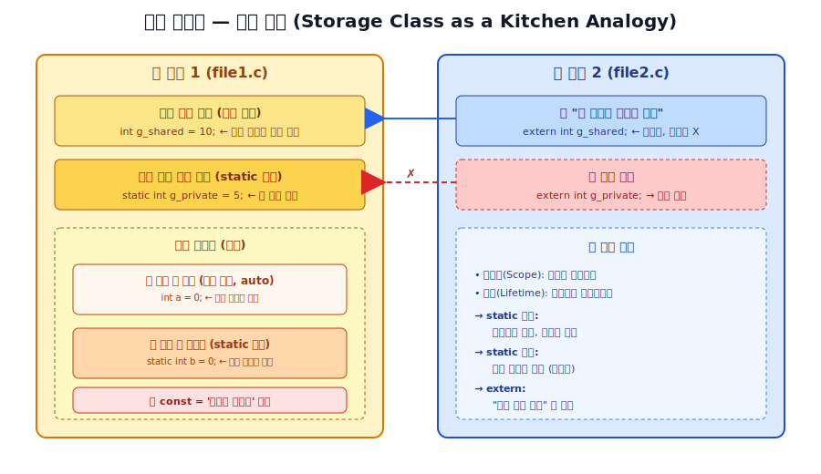

# Session 10 — 저장 클래스와 `const` 한정자

> **학습 목표**
> - 변수의 **스코프(범위)** 와 **수명(lifetime)** 을 구분해서 설명할 수 있다.
> - `auto`, `static`, `extern`, `register` 의 차이를 비유와 코드로 설명할 수 있다.
> - `const` 의 위치별 의미(특히 포인터와 결합 시)를 정확히 읽어낼 수 있다.
> - 두 개 이상의 `.c` 파일을 묶어 컴파일하는 흐름을 경험한다.

---

## 0. 시작하기 전에 — 주방 비유로 큰 그림 잡기

지난 시간까지 우리는 변수, 함수, 포인터를 배웠습니다. 그런데 변수에는 우리가 아직 명확히 다루지 않은 두 가지 성질이 있습니다.

- **어디서 보이는가** (스코프, Scope) → "이 양념통이 어느 주방, 어느 요리사에게 보이는가"
- **언제까지 살아있는가** (수명, Lifetime) → "이 양념통이 언제 만들어졌다가 언제 버려지는가"

이 두 가지를 결정하는 것이 바로 **저장 클래스(Storage Class)** 입니다.

### 주방 비유 한눈에 보기



| C 개념 | 주방 비유 |
|--------|-----------|
| 지역 변수 (`auto`) | 요리 한 접시 만들 때 **도마 위에 잠깐 올려둔 재료** — 요리 끝나면 치움 |
| `static` 지역 변수 | 요리사 **개인 서랍 속 비밀 양념통** — 요리 끝나도 그대로 보관 |
| 전역 변수 | 주방 한가운데 **공용 양념 선반** — 모든 요리사가 접근 |
| `extern` 변수 | "**옆 주방에 있는 양념 선반**, 거기 있는 거 알지?" 라고 선언만 함 |
| `static` 전역 변수 | "이 양념은 **우리 주방 전용**, 옆 주방엔 안 빌려줌" |
| `register` | "이 재료는 손에 계속 들고 있어" — CPU 레지스터에 두라는 힌트 |
| `const` | **'손대지 마시오' 라벨이 붙은 재료** — 한 번 정해지면 못 바꿈 |

---

## 1. 스코프(Scope)와 수명(Lifetime)

두 개념은 자주 헷갈리지만 다른 것입니다.

- **스코프**: 변수의 **이름이 보이는 코드 영역** (where)
- **수명**: 변수의 **메모리가 살아있는 시간** (when)

```c
#include <stdio.h>

void counter(void) {
    int a = 0;          // 매 호출마다 새로 태어남
    static int b = 0;   // 프로그램 시작 시 한 번만 태어남
    a++;
    b++;
    printf("a=%d, b=%d\n", a, b);
}

int main(void) {
    counter();  // a=1, b=1
    counter();  // a=1, b=2  ← b는 살아있음
    counter();  // a=1, b=3
    return 0;
}
```

- `a`: 스코프 = 함수 내부 / 수명 = 함수 호출 동안만
- `b`: 스코프 = 함수 내부 / 수명 = **프로그램 종료까지**

> 💡 **포인트**: `static` 지역 변수는 "**스코프는 좁히되, 수명은 늘리고 싶을 때**" 씁니다.

---

## 2. `auto` — 우리가 늘 써온 그것

```c
void foo(void) {
    auto int x = 10;  // 'auto' 키워드는 거의 안 씀
    int y = 20;       // 위와 동일 (auto 생략된 것)
}
```

- 모든 지역 변수의 기본 저장 클래스
- 사실상 **C에서는 쓸 일이 없는 키워드** (생략이 관례)
- ⚠️ **주의**: C++11 이후의 `auto` (자동 타입 추론) 와는 **완전히 다른 의미**. 같은 단어, 다른 언어, 다른 뜻.

---

## 3. `static` — 두 얼굴의 키워드

`static` 은 위치에 따라 **두 가지 완전히 다른 의미** 를 가집니다.

### 3-1. 함수 내부의 `static` → "수명 연장"

```c
#include <stdio.h>

void greet(void) {
    static int count = 0;  // 서랍 속 양념통
    count++;
    printf("%d번째 인사\n", count);
}

int main(void) {
    greet();  // 1번째 인사
    greet();  // 2번째 인사
    greet();  // 3번째 인사
    return 0;
}
```

- **초기화는 프로그램 시작 시 단 한 번** 만 이루어집니다.
- 함수가 끝나도 값이 유지됩니다.
- 외부에서는 접근 불가 (스코프는 여전히 함수 내부).

### 3-2. 파일 최상단의 `static` → "외부에 숨김"

```c
// utils.c
static int internal_count = 0;  // 이 파일에서만 보이는 변수
int public_count = 0;           // 다른 파일에서도 접근 가능

static void helper(void) {      // 이 파일에서만 보이는 함수
    /* ... */
}
```

- 다른 `.c` 파일에서 **이 변수/함수를 볼 수 없게** 만듭니다.
- 캡슐화 효과 — "이 변수는 우리 주방에서만 쓴다"
- 객체 지향의 `private` 과 비슷한 역할

> 💡 **핵심 정리**: `static` 의 의미는 **위치에 따라 다르다.** 함수 안에서는 "수명 연장", 함수 밖에서는 "가시성 제한".

---

## 4. `extern` — "거기 있다고 말해주는 것"

`extern` 은 **정의가 아니라 선언** 입니다.

> "이 변수는 어디 다른 파일에 정의되어 있어. 컴파일러야, 그게 있다고 믿고 컴파일해줘.
> 진짜 그게 있는지는 링커가 나중에 확인할 거야."

### 두 파일 예제

```c
/* === file1.c === */
int g_shared = 10;           // 정의 (메모리 할당)
static int g_private = 5;    // 이 파일 전용

void show_file1(void) {
    printf("file1: shared=%d, private=%d\n", g_shared, g_private);
}
```

```c
/* === file2.c === */
#include <stdio.h>

extern int g_shared;         // 선언 (메모리 할당 X)
// extern int g_private;    // 컴파일은 통과, 링크 에러 발생!

void show_file2(void) {
    printf("file2: shared=%d\n", g_shared);
    g_shared = 99;           // 같은 변수를 수정
}
```

```c
/* === main.c === */
void show_file1(void);
void show_file2(void);

int main(void) {
    show_file1();   // shared=10, private=5
    show_file2();   // shared=10
    show_file1();   // shared=99, private=5  ← 같은 변수!
    return 0;
}
```

### 컴파일 명령 (참고)

```bash
gcc file1.c file2.c main.c -o app
./app
```

### 정의(Definition) vs 선언(Declaration)

| 구분 | 정의 (Definition) | 선언 (Declaration) |
|------|------------------|-------------------|
| 메모리 | 할당함 | 할당 안 함 |
| 횟수 | 프로그램 전체에 **딱 1번** | 여러 번 가능 |
| 예시 | `int x = 10;` | `extern int x;` |
| 비유 | 양념통을 **실제로 만들기** | "옆 주방에 양념통 있다고 **알리기**" |

---

## 5. `register` — 거의 죽은 키워드

```c
void loop_demo(void) {
    register int i;   // "i를 CPU 레지스터에 둘 수 있으면 두렴" (힌트)
    for (i = 0; i < 1000000; i++) {
        /* ... */
    }
}
```

- 컴파일러에게 "이 변수를 자주 쓸 거니까 CPU 레지스터에 두면 좋겠어" 라고 **힌트만** 줌
- 현대 컴파일러는 옵티마이저가 더 똑똑함 → **대부분 무시**
- ⚠️ **제약**: `&register_var` 불가능 (주소 연산자 사용 금지)
- **전자공학부 관점**: CPU 레지스터의 물리적 의미를 환기하는 정도의 역사적 키워드

> 실무에서는 거의 안 쓰지만, "왜 안 쓰게 됐는지" 를 아는 것이 중요합니다.

---

## 6. `const` 한정자 — '손대지 마시오' 라벨

`const` 는 저장 클래스가 아니라 **타입 한정자(type qualifier)** 입니다. 하지만 변수 선언과 함께 자주 등장하므로 같이 다룹니다.

### 6-1. 기본 사용

```c
const int MAX_SIZE = 100;
// MAX_SIZE = 200;   // ❌ 컴파일 에러
```

- "이 변수의 값을 **이후로 바꾸지 마라**" 는 약속
- 컴파일 타임에 강제됨
- `#define MAX_SIZE 100` 과 비슷해 보이지만, **타입 정보가 있다** 는 점에서 더 안전

### 6-2. 포인터와 `const` — 가장 헷갈리는 부분

`const` 의 **위치** 가 핵심입니다. **`*` 를 기준으로 어디 있는지** 를 봅니다.

```c
int x = 10, y = 20;

// (1) 가리키는 값을 못 바꿈
const int *p1 = &x;
// *p1 = 999;    // ❌ 값 변경 불가
p1 = &y;         // ✅ 가리키는 곳 변경 가능

// (2) 가리키는 곳(주소)을 못 바꿈
int * const p2 = &x;
*p2 = 999;       // ✅ 값 변경 가능
// p2 = &y;      // ❌ 가리키는 곳 변경 불가

// (3) 둘 다 못 바꿈
const int * const p3 = &x;
// *p3 = 999;    // ❌
// p3 = &y;      // ❌
```

### 읽는 요령 — "오른쪽에서 왼쪽으로"

| 선언 | 읽는 법 |
|------|---------|
| `const int *p` | p는 → 포인터 → int → const (const int를 가리키는 포인터) |
| `int * const p` | p는 → const → 포인터 → int (int를 가리키는 const 포인터) |
| `const int * const p` | p는 → const → 포인터 → const int |

**주방 비유**:
- `const int *p1` = "**재료는 손대지 마**, 근데 다른 양념통은 가리켜도 돼"
- `int * const p2` = "이 양념통**만** 가리켜, 근데 안의 재료는 바꿔도 돼"
- `const int * const p3` = "이 양념통**만** 가리키고, 안의 재료**도** 손대지 마"

### 6-3. 함수 매개변수에서의 `const`

```c
// "내가 이 문자열을 안 바꿀게요" 라는 약속
size_t my_strlen(const char *s) {
    size_t len = 0;
    while (*s != '\0') {
        // *s = 'X';  // ❌ 컴파일 에러 — 실수 방지
        s++;
        len++;
    }
    return len;
}
```

- 함수가 **읽기만 하고 수정하지 않는다** 는 것을 호출자에게 보장
- 표준 라이브러리도 같은 관례: `strlen(const char *)`, `strcmp(const char *, const char *)`

> 💡 **실무 팁**: 포인터 매개변수가 **읽기 전용** 이면 무조건 `const` 를 붙이는 습관을 들이세요. 버그를 컴파일 타임에 잡을 수 있습니다.

---

## 7. 컴파일러별 동작 차이

기본 동작은 ISO C 표준이므로 **세 컴파일러 모두 동일** 합니다. 다만 다음 미세한 차이가 있습니다.

| 항목 | MSVC | GCC | Clang |
|------|------|-----|-------|
| `static` 지역 변수 초기화 | 표준 동일 | 표준 동일 | 표준 동일 |
| `register` 변수 무시 여부 | 거의 무시 | 거의 무시 | 거의 무시 |
| `const` 변수의 ROM 배치 | 임베디드 툴체인에 따라 다름 | `.rodata` 섹션 | `.rodata` 섹션 |
| 미초기화 `static`의 0 초기화 | ✅ 보장 | ✅ 보장 | ✅ 보장 |
| `extern` 다중 정의 시 에러 메시지 | `LNK2005` | `multiple definition of` | `duplicate symbol` |

> 📌 결론: 학습 단계에서는 컴파일러 차이를 신경 쓸 필요가 거의 없습니다. 단, 임베디드 환경(예: ARM Keil, IAR) 에서는 `const` 변수가 플래시 메모리에 배치되는 등 특수한 동작이 있습니다.

---

## 8. 핵심 비교표 (꼭 외워두세요)

| 키워드 | 스코프 | 수명 | 링키지 | 한 줄 설명 |
|--------|--------|------|--------|----------|
| (지역, auto) | 블록 | 블록 종료 시 소멸 | 없음 | 일반 지역 변수 |
| `static` (지역) | 블록 | 프로그램 종료까지 | 없음 | 함수 내 상태 유지 |
| (전역) | 파일 전체 + 외부 | 프로그램 종료까지 | 외부(external) | 전체 공유 가능 |
| `static` (전역) | 파일 전체 | 프로그램 종료까지 | 내부(internal) | 파일 내부 캡슐화 |
| `extern` | 선언된 곳부터 | 정의된 곳 따라감 | 외부 | 다른 파일 변수 참조 |
| `register` | 블록 | 블록 종료 시 소멸 | 없음 | (사실상 무의미) |
| `const` | 선언 위치 따라감 | 선언 위치 따라감 | — | 값 변경 금지 |

---

## 9. 실습 과제

### 과제 1 — `static` 지역 변수
호출될 때마다 다음 정수를 반환하는 `next_id()` 함수를 작성하세요. 첫 호출은 1을 반환합니다.

```c
int next_id(void);

int main(void) {
    printf("%d\n", next_id());  // 1
    printf("%d\n", next_id());  // 2
    printf("%d\n", next_id());  // 3
    return 0;
}
```

### 과제 2 — 분할 컴파일과 `extern`
세 파일로 분리하여 컴파일하세요.
- `counter.c`: 전역 변수 `int total = 0;` 와 함수 `void add(int n);` 정의
- `main.c`: `extern` 으로 `total` 참조, `add()` 호출 후 `total` 출력
- `counter.h`: 함수 선언만 포함

### 과제 3 — `const` 읽기
다음 선언이 각각 무엇을 의미하는지 한 줄로 설명하세요.

```c
const int a = 10;
const int *b;
int * const c = &some_int;
const int * const d = &some_int;
const char * const message = "Hello";
```

### 과제 4 — 임베디드 관점 (도전)
8비트 마이크로컨트롤러의 GPIO 레지스터 주소가 `0x40020000` 에 있다고 할 때, 이 주소를 가리키는 포인터를 어떻게 선언해야 할까요? 다음 시간에 배울 `volatile` 도 미리 고민해보세요.

---

## 10. 다음 시간 예고

**Session 11 — 분할 컴파일과 헤더 파일**
- 헤더 파일에 무엇을 넣고 무엇을 넣지 말아야 하는가
- 헤더 가드 (`#ifndef` ... `#define` ... `#endif`)
- `extern` 선언의 실전 위치
- `Makefile` 맛보기

이번 시간에 배운 `extern` 과 `static` 이 실제로 어떻게 쓰이는지를 보게 됩니다.

---

## 📚 참고 자료

- ISO/IEC 9899:2018 (C17 표준), §6.2.2 Linkages of identifiers, §6.2.4 Storage durations
- Brian W. Kernighan, Dennis M. Ritchie, *The C Programming Language* (2nd ed.), Ch. 4.4, 4.6
- GCC Manual — Storage Class Specifiers
- Microsoft Learn — Storage classes (C)
